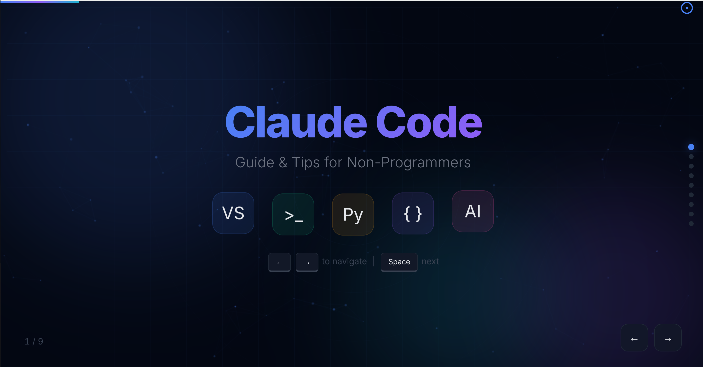
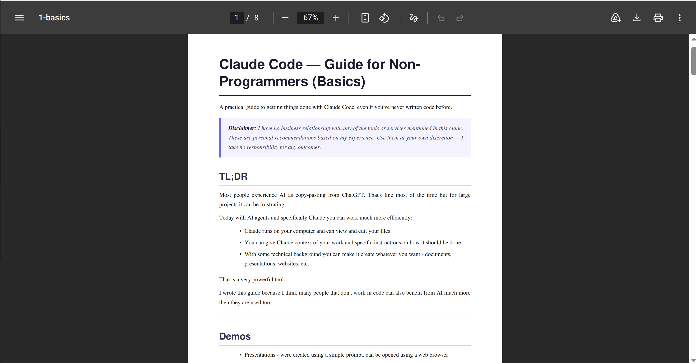

# Claude — Guide for Non-Programmers (Basics)

A practical guide to enhance your use of AI, even if you've never written code before.

## TL;DR

Most people experience AI as copy-pasting from ChatGPT.

That's fine most of the time, but it can be frustrating — especially for large projects, or when you have specific requirements and need to keep re-explaining them.

Today with AI agents and specifically Claude you can work much more efficiently:

- Claude runs on your computer and can view and edit your files, while you drink coffee.
- You can give Claude context of your work and specific instructions on how it should be done.
- With some technical background you can make it create whatever you want - documents, presentations, websites, etc.

That is a very powerful tool.

I wrote this guide because I think many people who don't work in code can benefit from AI much more than they're used to.

> **Disclaimer:** I have no business relationship with any of the tools or services mentioned in this guide. These are personal recommendations based on my experience. Use them at your own discretion — I take no responsibility for any outcomes.

---

## Demos

Let's start at the end - see what I created with Claude using a few simple prompts:

**Presentation** — a cool-looking slideshow, created from this guide's text:



**Document** — PDF version of this guide:



**Game** — a small space dodge game, playable in the browser:


All of these are in the `demos/` folder. The document was created using:

```bash
python markdown_to_pdf.py 1-basics.md -o demos/document.pdf
```

---

## Learning

This guide introduces you to some basic terms and technologies.

You want to know more? - Google it or ask your favorite LLM :)

Today you can learn and do anything - you are limited only by your imagination.

---

## Getting Started — What to Install

To follow this guide you need three things installed on your computer:

1. **VS Code** (free) — a text editor where you'll do all your work. Download from [code.visualstudio.com](https://code.visualstudio.com/). Just run the installer and open it.

2. **Python** (free) — a programming language that Claude uses behind the scenes to perform powerful actions. Download from [python.org/downloads](https://www.python.org/downloads/). During installation, make sure to check **"Add Python to PATH"**. You can verify it works by opening a terminal and typing `python --version`.

3. **Claude Code** (~20$) — the AI assistant itself. Install the Claude Code extension in VS Code: open VS Code → click the Extensions icon in the left sidebar (`Ctrl+Shift+X`) → search "Claude Code" → click Install. You'll need an Anthropic account to use it.

## Short Technical Background

Here are some terms that will help you get the most of Claude.

### Files

Your computer contains many files - pictures, documents, programs...

The most basic file is a text file — it contains only characters (no images or formatting).

Every text file has an **encoding** — the rule for how characters are stored. For English and standard symbols, "ASCII" is enough. For other languages (Hebrew, Arabic, Chinese, etc.), use "UTF-8".

### Python

Python is a programming language. You don't need to learn or understand it — just know that Claude can use Python behind the scenes to perform powerful actions for you, like processing data, converting files, or automating tasks. When Claude needs Python, it will handle everything automatically.

### Terminal

You can also control your computer by typing text commands instead of clicking buttons. This is called the **Terminal** (also known as Command Line or Command Prompt). Claude uses this to run scripts and tools for you.

---

## VS Code

### What is it?

VS Code (Visual Studio Code) is a free text editor by Microsoft. Think of it as a supercharged Notepad — it can open any file, color-code different languages, and run tools like Claude Code inside it.

### Key concepts

- **File Explorer** (left sidebar) — browse and open files in your project folder
- **Editor** (center) — where you view and edit files
- **Terminal** (bottom panel) — a command line built into VS Code
- **Extensions** (left sidebar, block icon) — add-ons (plugins) that give VS Code new abilities (like Claude Code, Python support, etc.)
- **Command Palette** — press `Ctrl+Shift+P` to search for any action

### Installing extensions

Extensions add features to VS Code — language support, themes, tools, and more. To install:

1. Click the **Extensions** icon in the left sidebar (or `Ctrl+Shift+X`)
2. Search for what you need
3. Click **Install**

**How to pick safe extensions:**

- **Prefer verified publishers** — look for the blue checkmark next to the publisher name. These are verified by Microsoft.
- **If not verified** — check the download count and ratings. Popular extensions (millions of downloads, 4+ stars) are generally safe.
- **Be careful** with unknown extensions that have few downloads — they could contain bugs or even malicious code. When in doubt, search online for recommendations.

### Essential shortcuts

| Action                                | Shortcut                               |
| ------------------------------------- | -------------------------------------- |
| Open Command Palette                  | `Ctrl+Shift+P`                         |
| Open file by name                     | `Ctrl+P`                               |
| Toggle terminal                       | `` Ctrl+` ``                           |
| Toggle sidebar                        | `Ctrl+B`                               |
| Save file                             | `Ctrl+S`                               |
| Find in file                          | `Ctrl+F`                               |
| Find in all files                     | `Ctrl+Shift+F`                         |
| Open Simple Browser (sidebar preview) | `Ctrl+Shift+P` → type "Simple Browser" |

> **Further reading:** [VS Code Getting Started](https://code.visualstudio.com/docs/getstarted/introvideos)

---

## Markdown

### What is it?

Markdown is a simple way to format text using plain characters. Files end in `.md`. This guide is written in Markdown.

### Syntax

```markdown
# Heading 1

## Heading 2

### Heading 3

**bold text**
_italic text_

- bullet point
- another bullet

1. numbered list
2. second item

[link text](https://example.com)

> blockquote

`inline code`
```

### How to preview

- In VS Code: open a `.md` file → `Ctrl+Shift+V` to preview, or `Ctrl+K V` to preview side-by-side
- You can ask Claude to create Markdown files and preview them directly in VS Code

> **Further reading:** [Markdown Guide](https://www.markdownguide.org/basic-syntax/)

---

### Creating PDF from markdown files

There is a helper script called `markdown_to_pdf.py` that converts Markdown files to PDF. To use it:

1. Copy the file `markdown_to_pdf.py` into your project folder
2. Ask Claude: "Convert my-document.md to PDF using markdown_to_pdf.py"

Claude will install the required dependencies and run the script for you.

---

## HTML, JavaScript & CSS

### What are they?

These three languages work together to create websites:

- **HTML** — the structure and content (headings, paragraphs, buttons)
- **CSS** — the styling (colors, fonts, layout)
- **JavaScript (JS)** — the behavior (what happens when you click things)

A basic website is just an `.html` file that can reference `.css` and `.js` files.

### How to open

1. Double-click any `.html` file — it opens in your default browser (Chrome, Firefox, etc.)
2. Or right-click the file → "Open with" → choose a browser
3. In VS Code, use the **Simple Browser** to preview without leaving the editor:
   `Ctrl+Shift+P` → type "Simple Browser: Show" → paste the file path

### Basic structure

```html
<!DOCTYPE html>
<html>
<head>
    <title>My Page</title>
    <style>
        body { font-family: sans-serif; margin: 40px; }
        h1 { color: darkblue; }
    </style>
</head>
<body>
    <h1>Hello!</h1>
    <p>This is a paragraph.</p>
    <button onclick="alert('clicked!')">Click me</button>
</body>
</html>
```

Save this as a `.html` file and open in a browser to see it work.

> **Further reading:** [MDN Web Docs — Getting Started](https://developer.mozilla.org/en-US/docs/Learn/Getting_started_with_the_web)

---

## Claude Code

### What is it?

Claude Code is an AI assistant that lives inside VS Code (or the terminal). It can read, create, and edit files on your computer. You talk to it in plain language and it does the work.

### Where can it be used?

- VSCode - Install plugin, `CTRL+SHIFT+P -> "Claude code: Open in Side Bar"`

### What can it do?

- **Edit files** — "change the heading color to red" or "fix the typo in paragraph 3"
- **Create files** — "create a document with sections for date, attendees, and action items" or "make a website with a contact form"
- **Explain things** — "what does this file do?"
- **Run commands** — it can run terminal commands on your behalf (like converting files, processing data, etc.)

### Can I create an app using Claude?

- **Website** — can be created very easily, but it will exist only on your computer.
  - If you want it to be accessible to others, you need to host it somewhere (a server that keeps it online).
  - If you want it to have a database and interact with other internet services — also possible but a bit more complicated.
- **Phone App** — not directly. Building a native phone app requires developer accounts (Apple/Google), specific tools, and a more complex setup. However, Claude can help you create a **web app** that works well on phones — it looks and feels like an app when opened in a mobile browser, and is much simpler to build and share.

### CLAUDE.md — giving Claude context

You can create a file called `CLAUDE.md` in your project folder to give Claude context and instructions. Claude reads this file automatically when it starts. Use it to describe your project and how Claude should work in it. For example:

```markdown
This is a marketing project. All documents should be in Hebrew.
Output files go in the "output" folder.
```

### Modes

| Mode            | What it can do                    | When to use                            |
| --------------- | --------------------------------- | -------------------------------------- |
| **Plan mode**   | Reads files, thinks, makes a plan | When you want to review before changes |
| **Normal mode** | Reads and edits files             | Day-to-day work                        |

### Permissions

Claude asks for permission before doing things like editing files or running commands. You can:

- **Allow once** — approve this single action
- **Allow for this project** — clicking "Yes, don't ask again" saves the permission for the current project folder. This means Claude won't ask again for the same type of action in this project, but will still ask in other projects.

> **Recommended for beginners:** approve each action individually ("Allow once") until you're comfortable with what Claude does. This way you stay in control and can review every change.

### Things to try

**Create Markdown documents:**

> "Create a markdown file called meeting-notes.md with sections for date, attendees, agenda, and action items"

**Build websites:**

> "Create a simple website with a dark theme that shows a list of my favorite books. Make it look nice."

**Create presentations:**

> Have text material you want to present? Ask Claude to turn it into a web-based slideshow. For example: "Create an HTML presentation from this text" — then open the `.html` file in your browser. It's a quick way to make good-looking slides without PowerPoint.

**Convert to PDF:**

> "Convert my-document.md to PDF using markdown_to_pdf.py"

**Preview in VS Code sidebar:**

> After creating an HTML file, open it in VS Code's Simple Browser: `Ctrl+Shift+P` → "Simple Browser: Show" → enter the file path

**Edit existing files:**

> "In index.html, change the background color to light gray and make the font bigger"

### Tips

- Be specific about what you want — "make the title blue and centered" works better than "make it look better"
- You can select text in VS Code and ask Claude about just that selection
- If Claude's change isn't what you wanted, just tell it — "undo that" or "no, I meant the other heading"
- Claude can work with any file type — text, code, config files, etc.

---

## What's Next?

Ready to go further? The [advanced guide](../2-advanced/README.md) covers:

- **Command Line** — understand how your computer runs processes under the hood
- **Git & GitHub** — save your work, track changes, and display it publicly from any computer or phone
- **Python** — create more complex and powerful operations with Claude
